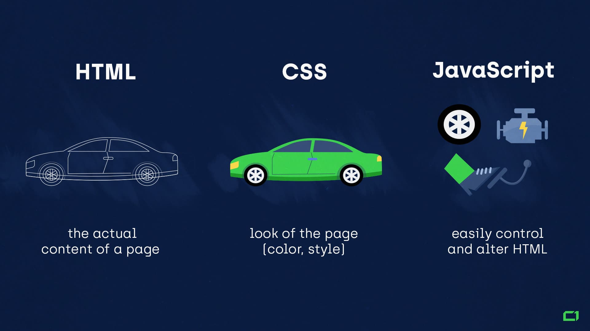

# Schedule Frontend, v26 - v33

Table of contents

- [HTML & CSS, v26](#html--css-v26)
- [JavaScript, v27](#javascript-v27)
- [JavaScript / React, v28](#javascript--react-v28)
- [React, v31 - v33](#react-v31---v33)

This segment of the course is divided in to three distinct parts. We have HTML/CSS, JavaScript and React. The purpose is to give you a general and basic understanding of Frontend and how to apply it as a future Fullstack Developer.

### HTML & CSS, v26

- [E-Learning - HTML & CSS Path](https://app.pluralsight.com/paths/skills/html-and-css)

  This is a general path for everything HTML & CSS related. Not mandatory but see it as a complement

- HTML

  - HTML Document
  - Syntax
  - Semantics
  - Most common elements
  - [E-Learning - HTML and CSS Fundamentals, part 1-3](https://app.pluralsight.com/library/courses/html-css-fundamentals/table-of-contents)

- CSS

  - Box Model
  - Syntax
  - Selectors
  - Specificity
  - Basic CSS
  - Flex & Grid
  - [E-Learning - HTML and CSS Fundamentals, part 4-5](https://app.pluralsight.com/library/courses/html-css-fundamentals/table-of-contents)

- Browser

  - The Inspector Tools
  - [E-Learning - Debugging Sites with Chrome DevTools, part 1-5](https://app.pluralsight.com/library/courses/chrome-developer-tools-debugging-sites/table-of-contents)

- Exercises

[Back to top](#schedule-frontend-v26---v33)

### JavaScript, v27

- [E-Learning - JavaScript Path](https://app.pluralsight.com/paths/skills/html-and-css)

  This is a general path for everything JavaScript related. Not mandatory but see it as a complement

- **1st & 2nd July**

  Niklas will be away _( riding carousels at Liseberg ^^ )_, Dimitris will go through the HTTP protocol and give an intro to API:s.

- From C# to JS
- DOM
- DOM-manipulation
- Exercises

[Back to top](#schedule-frontend-v26---v33)

### JavaScript / React, v28

- JavaScript

  - Event Handling
  - Fetch API
  - Exercises
  - [E-Learning - JavaScript Fundamentals part 8](https://app.pluralsight.com/library/courses/fundamentals-javascript/table-of-contents)

- React

  - TypeScript
  - Intro React
  - Components
  - Props
  - Exercises

[Back to top](#schedule-frontend-v26---v33)

### **SUMMER HOLIDAY** , v29 & v30

You do whatever you want to do!

### React, v31 - v33.

- Repetition
- Routing
- State management
- Global state management
- Bigger exercises

#### Week 31

- **Repetition**: Code along with React version of Caffe Retro

- **Lectures**: useState & useRef. Basics and then a code along on a React version of Account Registration

- **Exercises**: Media Player _( UI Only )_, Movie Cards.

#### Week 32

- **Lectures**: React router, Context and useEffect. Basics with code alongs.
- **Exercises**: Todo List. 

#### Week 33

[Back to top](#schedule-frontend-v26---v33)

